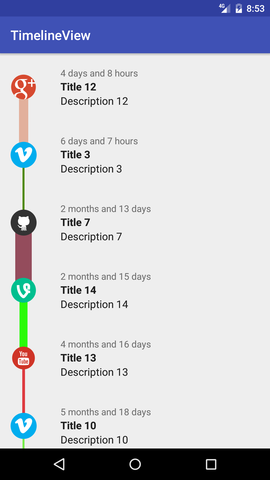

# Customizable Timeline View for Android
Customizable Timeline View for Android, Create a simple timeline list with few lines of code. You can adjust the image, image size, line color and line size.



# Download
Add it in your root `build.gradle` at the end of repositories:

```
allprojects {
		repositories {
			...
			maven { url 'https://jitpack.io' }
		}
	}
```
Add the dependency:

```
	dependencies {
	        compile 'com.github.qapqap:TimelineView:v1.2'
	}
```

# Usage

In your activity java class:
```
//Create Timeline Rows List
ArrayList<TimelineRow> TimelineRowsList = new ArrayList<>();

// Add Row to the List
TimelineRowsList.add(
        new TimelineRow(
                //Row Id
                1
                //Row Date
                ,new Date()
                //Row Title or null
                ,"Title"
                //Row Description or null
                ,"Description"
                //Row bitmap Image or null
                ,BitmapFactory.decodeResource(getResources(), R.drawable.img_0)
                //Row Bellow Line Color
                , Color.argb(255, 255, 255, 255)
                //Row Bellow Line Size in dp
                , 25
                //Row Image Size in dp
                , 25
                //Row image Background color or -1
                , Color.argb(255, 255, 255, 255)
                //Row image Background Size in dp or -1
                , 25
	)
);

//Create the Timeline Adapter
ArrayAdapter<TimelineRow> myAdapter = new TimelineViewAdapter(this, 0, TimelineRowsList,
//if true, list will be arranged by date
                true);

//Get the ListView and Bind it with the Timeline Adapter
ListView myListView = (ListView) findViewById(R.id.timelineListView);
myListView.setAdapter(myAdapter);
```

In your activity layout xml
```
    <ListView
        android:id="@+id/timelineListView"
        android:layout_width="match_parent"
        android:layout_height="match_parent"
        android:divider="@null"
        android:dividerHeight="0dp"
        >
    </ListView>
```

License
--------

    Copyright 2016 Abdullah Alsulaiman.

    Licensed under the Apache License, Version 2.0 (the "License");
    you may not use this file except in compliance with the License.
    You may obtain a copy of the License at

       http://www.apache.org/licenses/LICENSE-2.0

    Unless required by applicable law or agreed to in writing, software
    distributed under the License is distributed on an "AS IS" BASIS,
    WITHOUT WARRANTIES OR CONDITIONS OF ANY KIND, either express or implied.
    See the License for the specific language governing permissions and
    limitations under the License.
